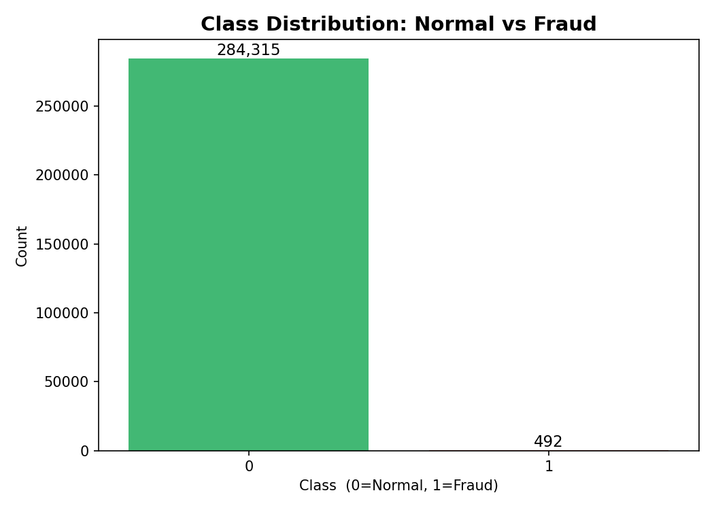
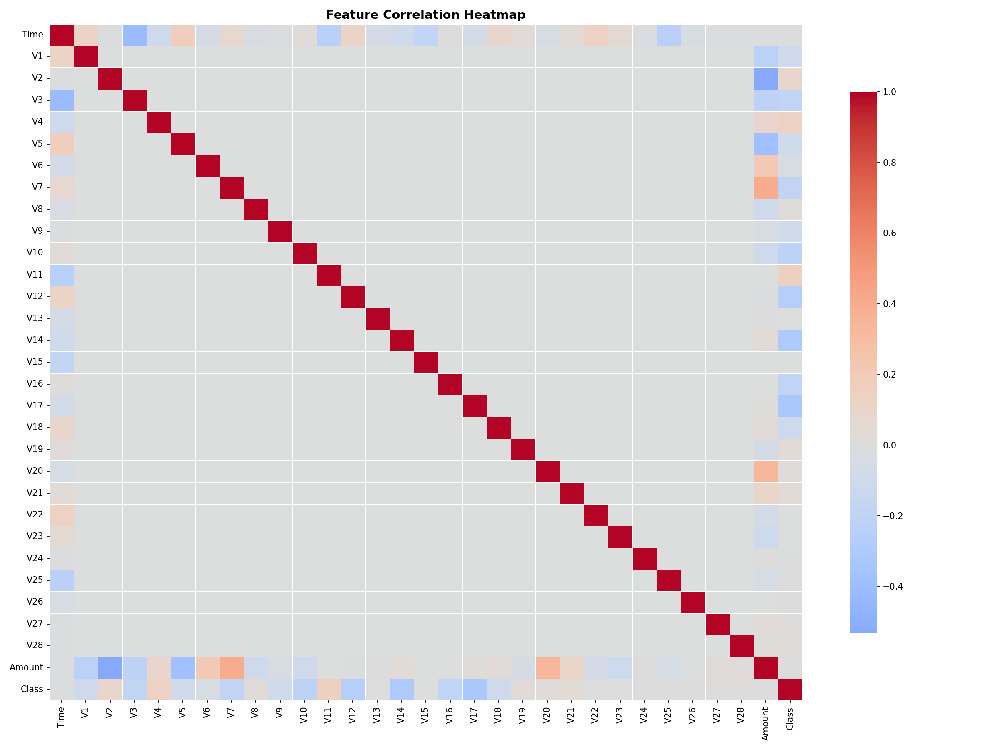
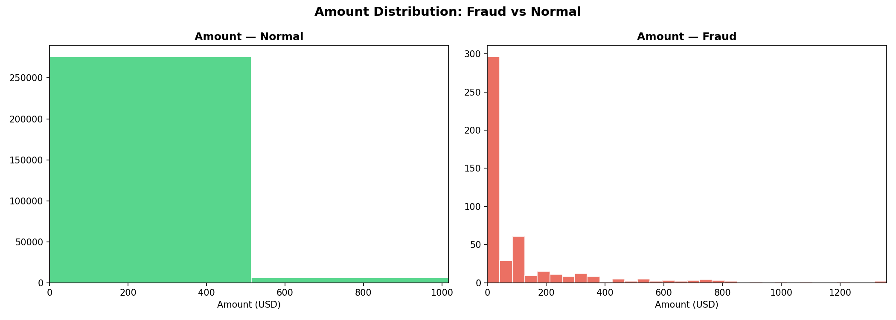
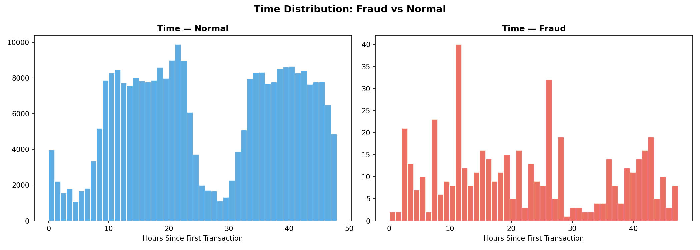
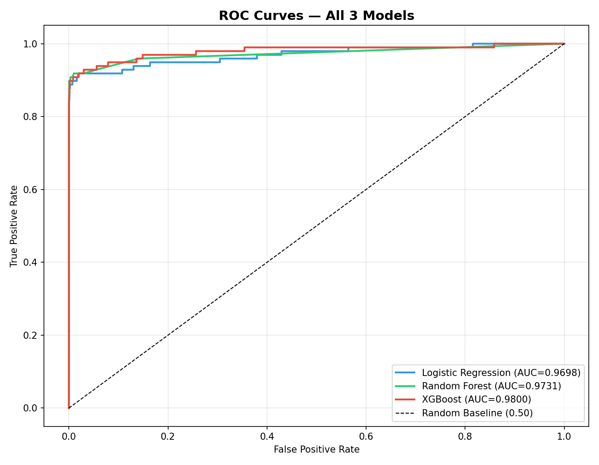
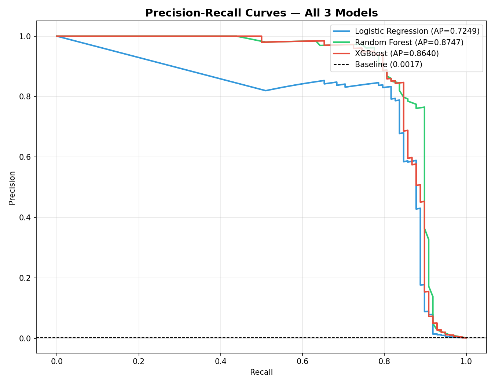
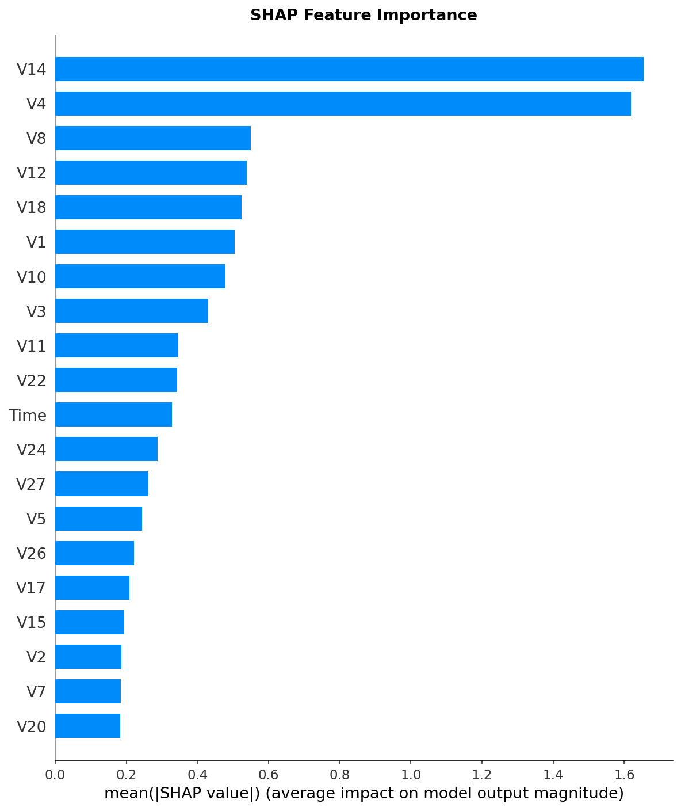
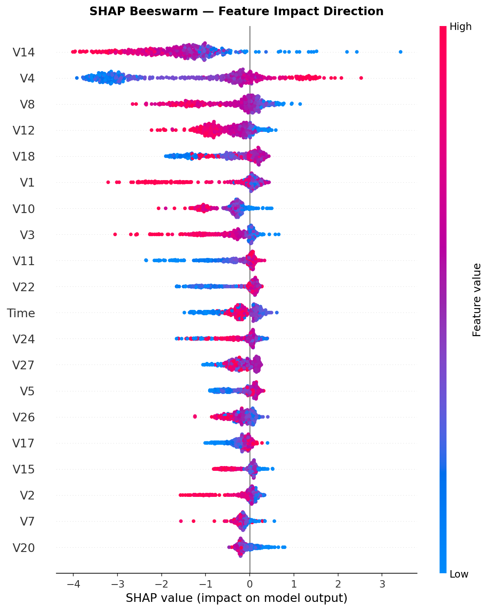

# 💳 Credit Card Fraud Detection — End-to-End ML Pipeline

> Detecting financial fraud in 284,807 transactions using XGBoost, SMOTE oversampling, and SHAP explainability. **AUC-ROC: 0.9800 | Average Precision: 0.8640**

<br>

## ⚡ Why This Problem Is Hard

Fraud detection is a needle-in-a-haystack problem: **1 fraud in every 577 transactions (0.17%)**. A model that labels every transaction as "normal" achieves **99.83% accuracy** — while catching **zero fraud**. Accuracy is completely useless here.

This project tackles that with three techniques used in real production fraud systems:
- **SMOTE** — generates synthetic fraud examples to fix the class imbalance
- **AUC-ROC + Average Precision** — metrics that actually measure fraud-catching ability
- **SHAP** — explains *why* the model flagged a transaction (legally required at real banks)

<br>

## 📊 Results

| Model | AUC-ROC | Avg Precision | Fraud Recall | Fraud Precision |
|---|---|---|---|---|
| Logistic Regression | 0.9698 | 0.7249 | 0.92 | 0.06 |
| Random Forest | 0.9731 | 0.8747 | 0.84 | 0.85 |
| **XGBoost** ✅ | **0.9800** | **0.8640** | **0.88** | **0.53** |

**XGBoost chosen as best model** — highest AUC-ROC (best overall discrimination) and strongest Average Precision (best performance on the rare fraud class).

> **What AUC-ROC 0.98 means in plain English:** If you randomly pick one fraud transaction and one normal transaction, this model assigns a higher fraud score to the fraud one **98% of the time**.

<br>

## 📸 Visualisations

### Class Imbalance — The Core Problem


### Feature Correlations


### Transaction Amount: Fraud vs Normal


### Transaction Time: Fraud vs Normal


### ROC Curves — All 3 Models


### Precision-Recall Curves — All 3 Models


### SHAP — Global Feature Importance


### SHAP — Feature Impact Direction


<br>

## 📁 Dataset

| Property | Value |
|---|---|
| Source | [Kaggle — ULB Credit Card Fraud](https://www.kaggle.com/datasets/mlg-ulb/creditcardfraud) |
| Total Transactions | 284,807 |
| Fraud Cases | 492 **(0.1727%)** |
| Normal Cases | 284,315 |
| Imbalance Ratio | 1 : 577 |
| Missing Values | None |
| Features | V1–V28 (PCA-anonymised), Time, Amount, Class |

> V1–V28 are PCA-transformed by the dataset provider to protect cardholder privacy. Only `Amount` and `Time` required manual scaling.

<br>

## 🛠️ Tech Stack

| Library | Version | Purpose |
|---|---|---|
| `pandas` | 3.0.3 | Data loading and manipulation |
| `numpy` | 2.4.6 | Numerical array operations |
| `matplotlib` | 3.10.9 | Core plotting |
| `seaborn` | 0.13.2 | Statistical visualisations |
| `scikit-learn` | 1.8.0 | Preprocessing, models, metrics |
| `imbalanced-learn` | 0.14.1 | SMOTE oversampling |
| `xgboost` | 3.2.0 | Gradient boosted trees |
| `shap` | 0.52.0 | Model explainability |
| `joblib` | 1.5.3 | Model serialisation |

<br>

## 🗂️ Project Structure

```
fraud-detection/
│
├── data/
│   └── creditcard.csv              ← download from Kaggle
│
├── outputs/
│   ├── plots/                      ← 8 visualisations (auto-generated)
│   │   ├── 01_class_distribution.png
│   │   ├── 02_correlation_heatmap.png
│   │   ├── 03_amount_distribution.png
│   │   ├── 04_time_distribution.png
│   │   ├── 05_roc_curves.png
│   │   ├── 06_precision_recall_curves.png
│   │   ├── 07_shap_summary_bar.png
│   │   └── 08_shap_beeswarm.png
│   └── models/
│       └── xgboost_fraud_model.joblib  ← saved trained model
│
├── 01_eda.py                       ← Exploratory Data Analysis
├── 02_preprocessing.py             ← Scaling + SMOTE
├── 03_train_models.py              ← Train + Evaluate + Save
├── 04_shap_explain.py              ← SHAP explainability
├── 05_inference.py                 ← Production inference simulation
├── requirements.txt
└── README.md
```

<br>

## 🚀 How to Run

```bash
# 1. Clone the repo
git clone https://github.com/YOUR_USERNAME/credit-card-fraud-detection.git
cd credit-card-fraud-detection

# 2. Create and activate virtual environment
python -m venv venv
venv\Scripts\activate          # Windows
# source venv/bin/activate     # Mac/Linux

# 3. Install dependencies
pip install numpy pandas matplotlib seaborn scikit-learn imbalanced-learn xgboost shap joblib

# 4. Download creditcard.csv from Kaggle and place it in data/

# 5. Run the pipeline in order
python 01_eda.py
python 02_preprocessing.py
python 03_train_models.py
python 04_shap_explain.py
python 05_inference.py
```

> All plots save automatically to `outputs/plots/`. No window will open — files are written directly to disk.

<br>

## 🧮 Mathematical Foundation

### 1. Why Accuracy Fails on Imbalanced Data

With 0.1727% fraud, a model predicting "normal" for everything scores:

```
Accuracy = 284,315 / 284,807 = 99.83%
```

It catches **0 fraud**. Accuracy rewards the majority class and is meaningless here. We need metrics that directly measure performance on the **minority (fraud) class**.

---

### 2. AUC-ROC — What It Actually Measures

The ROC curve plots **True Positive Rate vs False Positive Rate** at every possible classification threshold from 0.0 to 1.0:

```
TPR (Recall)  =  TP / (TP + FN)   ← of all real fraud, what % did we catch?
FPR           =  FP / (FP + TN)   ← of all normal, what % did we wrongly flag?
```

**The probabilistic interpretation of AUC:**

> AUC = the probability that, given one random fraud transaction and one random normal transaction, the model assigns a **higher fraud score** to the fraud one.

| AUC | Meaning |
|---|---|
| 1.00 | Perfect model |
| 0.98 | This project's XGBoost |
| 0.50 | Random guessing |
| 0.00 | Perfectly wrong (just flip predictions) |

---

### 3. SMOTE — Synthetic Minority Over-sampling

**The problem:** Training data has only 394 fraud examples. No model can learn a reliable decision boundary from 394 samples out of 227,845.

**How SMOTE works — 3 steps:**

1. For each minority (fraud) sample **x_i**, find its **k nearest fraud neighbours** (default k=5)
2. Randomly pick one neighbour **x_nn**
3. Create a synthetic sample anywhere on the line between them:

```
x_synthetic = x_i + λ × (x_nn − x_i),   where λ ~ Uniform(0, 1)
```

**Result:** 394 fraud examples → 227,451 fraud examples. Training set goes from 227,845 to 454,902 samples, now perfectly balanced.

**The critical rule:** SMOTE is applied **only to training data**. Applying it to the test set would create artificial data that doesn't reflect the real-world 0.17% distribution — your metrics would look great but the model would fail in production. This is **data leakage**.

---

### 4. SHAP Values — The Shapley Formula

SHAP (SHapley Additive exPlanations) comes from cooperative game theory. The SHAP value for feature *j* in prediction *x* is:

```
φⱼ = Σ  [|S|! (|F| - |S| - 1)! / |F|!] × [f(S ∪ {j}) − f(S)]
    S⊆F\{j}
```

Where:
- **F** = full set of features
- **S** = a subset of features not including j
- **f(S ∪ {j}) − f(S)** = marginal contribution of adding feature j to subset S

**In plain English:** SHAP measures each feature's contribution to pushing a prediction away from the average, averaged fairly across all possible orderings of features.

**Key property (local accuracy):**
```
Σ φⱼ  =  f(x) − E[f(x)]
```
All SHAP values sum exactly to the difference between this prediction and the dataset average. This makes the explanation **mathematically faithful** to the model.

---

### 5. Why Recall > Precision for Fraud Detection

This is a **cost asymmetry** problem:

| Error | What It Means | Real-World Cost |
|---|---|---|
| False Negative (FN) | Fraud labelled as normal — **missed** | Customer loses money. Bank loses reputation. Potential legal liability. |
| False Positive (FP) | Normal labelled as fraud — **false alarm** | Customer gets a text alert. Quick phone call resolves it. |

**Cost(FN) >> Cost(FP)** by orders of magnitude. Therefore we optimise for high **Recall** (catch all fraud, tolerate some false alarms).

Mathematically, lowering the classification threshold from 0.5 → 0.3:
- **Recall increases** — we catch more fraud
- **Precision decreases** — more false alarms

The optimal threshold is chosen from the Precision-Recall curve based on the business's specific tolerance for false alarms vs. missed fraud. At a bank, this is a product decision, not a purely technical one.

<br>

## 💡 Key Learnings

- A **99.83% accurate** model can catch zero fraud — always interrogate your evaluation metric before trusting it.
- **SMOTE on test data = data leakage** — the single most common and most expensive mistake in imbalanced ML.
- **XGBoost's sequential boosting** (each tree corrects previous errors) consistently outperforms Random Forest's parallel bagging on structured tabular data.
- **SHAP values** bridge the gap between black-box ML models and explainable decisions — a legal requirement in real financial systems, not just a nice-to-have.
- **AUC-ROC is threshold-invariant** — it measures discriminative power across all thresholds, not just 0.5, making it a fairer comparison across models.

<br>

## 👤 Author

**Prasanna Chidambar Marihalkar**  
B.Tech Computer Science — PES University, Bengaluru  


- 🔗 GitHub: [github.com/YOUR_USERNAME](https://github.com/PrasannaMarihalkar)

<br>

---


